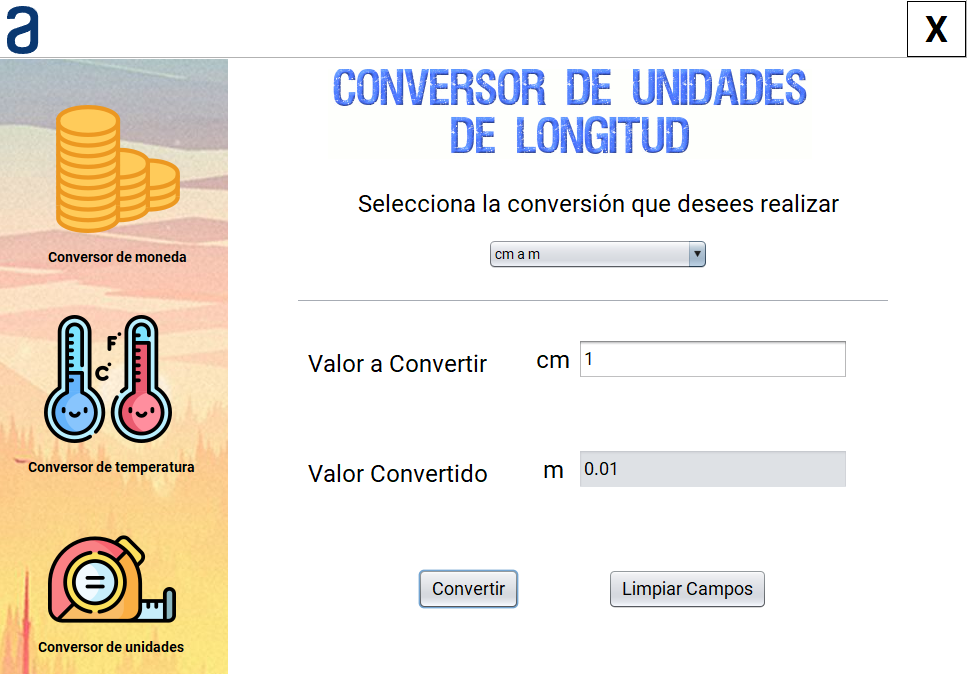

# Conversor Alura

Este proyecto esta pensado y diseñado para poder cumplir con la funcionalidad de realizar transformaciones de diferentes tipos de valores, dentro de estos tipos de
camios se encuetran 3 categorias nombradas como: Conversor de moneda, Conversor de temperatura, Conversor de unidades de longitud y las cuales tienen varias unidades 
dentro para seleccionar.

Adicionalmente, se debe mencionar que este proyecto fue realizado en el lenguaje de programación Java en el IDE Apache Netbeans con las interfaces graficas que proporciona Jswing.

## Conversor de moneda

En este apartado se puede encontrar las monedas más conocidas como ($) Dolar Estadounidense, (€) Euro, (£) Libra Esterlina, (¥) Yen, (₩) Won Sur Coreano, con este tipo
de monedas se puede realizar los cambios respectivos entre ellas.

## Conversor de Temperatura

En este apartado se puede encontrar los grados con los que se midan la temperatura en diferentes lugares del mundo, estas temperaturas son: (°C) grados celsius, (°F) 
grados farenheit, (°K) grados Kelvin, y los diferentes cambios que existen entre ellas.

## Conversor de Unidades de longitud

En este apartado se puede encontrar las unidades de longitud mas conocidas como: (Km) Kilometro, (m) Metro, (cm) Centimetro, (mm) Milimetro, y entre las cuales se puede 
realizar las conversiones que se deseen y seleccionen con el combobox dentro del formulario.

